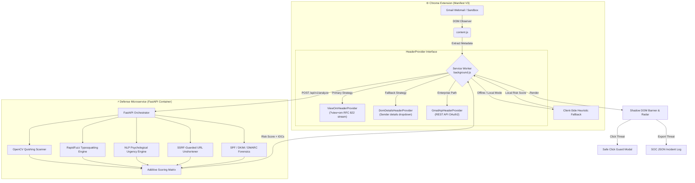

<div align="center">

# 🛡️ PhishShield AI (v1.4)
### Real-Time Deep Phishing & Quishing Defense Engine for Gmail

[](https://developer.chrome.com/docs/extensions/mv3/intro/)
[](https://fastapi.tiangolo.com)
[](https://www.python.org/)
[](https://opencv.org/)
[](https://www.docker.com/)
[](https://attack.mitre.org/)
[](LICENSE)

<p align="center">
  <b>An enterprise-grade hybrid defense system that halts advanced credential harvesting, executive impersonation (BEC), typosquatting, and Quishing (QR code phishing) directly inside Gmail before users click.</b>
</p>

[Key Features](#-key-capabilities) • [Architecture](#-architecture--threat-pipeline) • [Quickstart](#-quickstart-local-development) • [Deployment Guide](#-production-deployment-guide) • [MITRE ATT&CK](#-mitre-attck-matrix) • [API Docs](#-backend-api-reference)

---

</div>

## 🌟 Overview

Modern email threats have evolved past standard spam filters. Attackers routinely weaponize:
1. **Quishing (QR Code Phishing):** Embedding malicious login URLs inside QR image attachments and banners to evade optical character recognition and standard text-based scanning.
2. **Executive Display-Name Spoofing:** Registering burner `@gmail.com` accounts disguised with names of C-level executives to demand emergency gift cards or wire transfers.
3. **Punycode & Typosquatting:** Registering visual lookalike domains (e.g., `micros0ft.com`, `paypa1.com`) with deceptive anchor text.
4. **Psychological Urgency & Social Engineering:** Manufacturing false panic (*"Account suspended in 2 hours!"*) to force impulsive actions.

**PhishShield AI** provides active, layered defense via a lightweight **Chrome Manifest V3 Extension** connected to an ultra-fast **FastAPI Computer Vision & NLP Microservice**. It operates directly within the Gmail interface, intercepting threats, rendering zero-bleed Shadow DOM warning banners, and trapping clicks with an interactive educational modal.

---

## ⚡ Key Capabilities

| Vector | Defensive Capability | Technology Stack |
| :--- | :--- | :--- |
| **📷 Quishing Defense** | Computer vision engine scans embedded email images, extracts QR codes, decodes destination URLs, and projects a glowing red **Quishing Radar** overlay. | OpenCV (`QRCodeDetector`), NumPy, Async Image Decoders |
| **🎭 Display-Name Spoofing** | Detects C-suite / corporate names paired with public webmail domains (e.g. `CEO <ceo.urgent.corp@gmail.com>`) or mismatched `Reply-To`. | RFC 822 Header Parser, Heuristic Identity Correlator |
| **🔤 Typosquatting Forensics** | Calculates C++ Levenshtein distance, homoglyph substitutions, and Punycode IDNs against the top 500 enterprise brands. | `RapidFuzz` (C++ Levenshtein), `tldextract` |
| **🧠 Psychological NLP** | Identifies artificial panic, deadline pressure, wire fraud pretexts, and coercive language in subject and body text. | Multi-tier NLP Heuristic Rule Engine |
| **🛡️ Safe Click Guard** | Halts browser navigation upon clicking suspicious links. Displays an isolated modal detailing risk factors and teachable moments. | Event Interceptor, Teachable Moment UI |
| **📦 Zero-Bleed Shadow DOM** | Injects warning banners, badges, and modals inside isolated Shadow Roots to prevent Gmail CSS leakage and bypass CSP restrictions. | Custom Element Web Components |
| **🔬 SOC Incident Drawer** | Expandable banner panel showing MITRE ATT&CK technique IDs, additive scoring breakdowns, and 1-click **SOC JSON Incident Export**. | JSON SIEM Exporter, Threat Matrix Engine |
| **🔒 Zero-Telemetry Privacy** | Includes an instant **Local-Only Mode** toggle for air-gapped environments, performing regex and domain heuristics purely on-device. | Chrome Storage API, Client-Side Heuristics |

---

## 📐 Architecture & Threat Pipeline



---

## 📊 Threat Scoring Calibration

PhishShield uses a transparent, additive 0–100 point matrix:

| IOC Flag | Points Added | Threat Trigger Rationale |
| :--- | :---: | :--- |
| **🚨 Quishing (QR Code MFA)** | `+40` | Hidden destination URL embedded in image to bypass text filters |
| **🔤 Typosquatting / Lookalike** | `+35` | Domain Levenshtein similarity score $\ge 82\%$ against monitored brand |
| **🎭 Display-Name Spoofing** | `+30` | Well-known brand/executive name emailing from free public provider |
| **📎 Executable Disguise** | `+25` | Double extension attachment (e.g., `invoice.pdf.exe` or `.scr`) |
| **🔗 Anchor Text Mismatch** | `+25` | Display text says `paypal.com` but underlying `href` points elsewhere |
| **⚠️ High Psychological Urgency** | `+20` | Coercive pressure, immediate account suspension threat, or wire request |
| **↩️ Suspicious Reply-To** | `+20` | `Reply-To` address does not match `From` sender domain |
| **🌐 Newly Registered Domain** | `+20` | Domain registered within past 30 days |
| **📉 Moderate Urgency Pretext** | `+10` | Standard urgency indicators without immediate financial demand |

### Verdict Tiers
- 🟢 **0 – 24 pts (SAFE):** Verified sender, clean domain reputation, no anomalies.
- 🟡 **25 – 49 pts (SUSPICIOUS):** Caution advisory. Mild urgency, external sender, or redirect chain.
- 🔴 **50 – 100 pts (CRITICAL_PHISHING):** Active attack detected. Banners glow red, links are boxed with warning badges, and Click Guard activates.

---

## 🧪 Interactive Presentation Sandbox

PhishShield includes a self-contained test environment for demonstrations and evaluations.

1. Click the **PhishShield AI** shield icon in your browser toolbar and click **"🧪 Open Demo Sandbox"**  
   *(or open `extension/demo_sandbox.html` directly in Chrome)*.
2. Select any of the **4 interactive threat scenarios**:
   - **Scenario 1 (Safe):** GitHub security notice with valid headers $\rightarrow$ 🟢 *Verified Safe*.
   - **Scenario 2 (Executive BEC):** CEO requesting emergency gift cards from `@gmail.com` $\rightarrow$ 🟡 *Caution Advisory*.
   - **Scenario 3 (Credential Harvester):** Microsoft password expiry alert with typosquatted link (`micros0ft-login.top`) and `.pdf.exe` attachment $\rightarrow$ 🔴 *Critical Alert* + *Click Guard Interceptor*.
   - **Scenario 4 (Quishing QR Attack):** IT multi-factor enrollment notice with an embedded QR code $\rightarrow$ 🚨 *Computer vision decodes the QR code, wraps it in a Quishing Radar overlay, and alerts the user!*
3. Click **"▼ Details"** on any injected banner to view the MITRE technique breakdown and click **"📥 Export SOC Report (JSON)"** to download the structured incident payload.

---

## 🚀 Quickstart (Local Development)

### 1. Prerequisites
- Python 3.10+ installed
- Google Chrome, Microsoft Edge, or Brave browser

### 2. Launch the Backend Microservice
Double-click [`backend/start_backend.bat`](file:///C:/Users/kpsum/phishshield/backend/start_backend.bat) or run:
```powershell
# Navigate to the backend directory
cd backend

# Create and activate virtual environment
python -m venv venv
.\venv\Scripts\Activate.ps1

# Install dependencies
pip install -r requirements.txt

# Start FastAPI server
python -m uvicorn app:app --host 127.0.0.1 --port 8000 --reload
```
*Health check URL: `http://127.0.0.1:8000/api/v1/health`*  
*Interactive Swagger API Docs: `http://127.0.0.1:8000/docs`*

### 3. Load the Extension into Chrome
1. Open Google Chrome and navigate to `chrome://extensions/`.
2. Toggle on **Developer mode** in the top-right corner.
3. Click **"Load unpacked"**.
4. Select the `extension/` folder inside this repository.
5. The **PhishShield AI** extension is now active!

---

## 🚢 Production Deployment Guide

PhishShield AI utilizes a hybrid architecture:
- **Client Tier:** Chrome Manifest V3 Web Extension.
- **Server Tier:** Containerized Python FastAPI Microservice.

Here is how to deploy both tiers into production.

---

### Track A: Backend Microservice Deployment

> [!IMPORTANT]
> **HTTPS is Mandatory for Production Web Extensions:**
> Chrome's Manifest V3 Content Security Policy (CSP) strictly blocks remote HTTP connections from extension content scripts and service workers. Your production backend must be hosted behind a valid TLS/SSL certificate (`https://`).

#### Option 1: Turnkey Docker & Docker Compose (Recommended)
A pre-configured production Dockerfile and `docker-compose.yml` are provided in the repository.

```bash
# Build and run the container in the background
docker compose up -d --build

# View container logs
docker compose logs -f

# Verify container health
curl http://localhost:8000/api/v1/health
```

#### Option 2: Cloud Serverless (Google Cloud Run / AWS / Render)

##### A. Google Cloud Run (Fully Managed, Auto-scaling)
```bash
# 1. Build and push image using Google Artifact Registry or Google Cloud Build
gcloud builds submit --tag gcr.io/YOUR_PROJECT_ID/phishshield-backend:latest ./backend

# 2. Deploy to Cloud Run with automatic HTTPS
gcloud run deploy phishshield-backend \
  --image gcr.io/YOUR_PROJECT_ID/phishshield-backend:latest \
  --platform managed \
  --region us-central1 \
  --allow-unauthenticated \
  --memory 1Gi \
  --cpu 1
```
*Cloud Run will provision a dedicated HTTPS URL (e.g. `https://phishshield-backend-xyz.run.app`).*

##### B. Render / Railway / Fly.io (1-Click Git Deploy)
1. Fork or push this repository to GitHub.
2. Link your repository in [Render.com](https://render.com) or [Railway.app](https://railway.app).
3. Select **Docker Service** and specify Dockerfile path: `backend/Dockerfile`.
4. Render automatically attaches a free TLS/SSL certificate (`https://your-service.onrender.com`).

#### Option 3: Production Linux VPS (Ubuntu + Nginx + Certbot Let's Encrypt)

1. **Setup Systemd Service** (`/etc/systemd/system/phishshield.service`):
```ini
[Unit]
Description=PhishShield AI FastAPI Defense Engine
After=network.target

[Service]
User=www-data
Group=www-data
WorkingDirectory=/var/www/phishshield/backend
Environment="PATH=/var/www/phishshield/backend/venv/bin"
ExecStart=/var/www/phishshield/backend/venv/bin/uvicorn app:app --host 127.0.0.1 --port 8000 --workers 4
Restart=always

[Install]
WantedBy=multi-user.target
```

2. **Nginx Reverse Proxy with SSL** (`/etc/nginx/sites-available/phishshield`):
```nginx
server {
    server_name api.phishshield.yourcompany.com;

    location / {
        proxy_pass http://127.0.0.1:8000;
        proxy_set_header Host $host;
        proxy_set_header X-Real-IP $remote_addr;
        proxy_set_header X-Forwarded-For $proxy_add_x_forwarded_for;
        proxy_set_header X-Forwarded-Proto $scheme;
        proxy_read_timeout 10s;
    }
}
```

3. **Enable HTTPS with Let's Encrypt**:
```bash
sudo certbot --nginx -d api.phishshield.yourcompany.com
sudo systemctl restart nginx
sudo systemctl enable --now phishshield
```

---

### Track B: Chrome Extension Deployment

#### 1. Configure the Production Backend URL
In `extension/background.js`, the extension automatically checks `chrome.storage.local` for a custom backend URL, or you can update the fallback:
```javascript
const DEFAULT_BACKEND_URL = "https://api.phishshield.yourcompany.com";
```
Ensure your production domain is listed under `host_permissions` in `extension/manifest.json`:
```json
"host_permissions": [
  "https://mail.google.com/*",
  "https://api.phishshield.yourcompany.com/*"
]
```

#### 2. Chrome Web Store Packaging
1. Open terminal and package the `extension/` folder into a clean ZIP archive (excluding `.git` and development artifacts):
```powershell
Compress-Archive -Path extension\* -DestinationPath PhishShield_Extension_v1.4.zip
```
2. Log into the [Chrome Web Store Developer Dashboard](https://chrome.google.com/webstore/devconsole).
3. Click **"New Item"** and upload `PhishShield_Extension_v1.4.zip`.
4. Complete the **Store Listing**:
   - **Category:** Productivity / Security Tools.
   - **Single Purpose Description:** *"Real-time email security extension that detects and alerts users to phishing, display-name impersonation, and quishing attacks in webmail."*
   - **Permission Justifications:**
     - `activeTab`: Used to display the security status popup for the active email tab.
     - `storage`: Stores user preferences (e.g. Local-Only Mode) and cached threat verdicts.
     - `cookies`: Required by the `ViewOmHeaderProvider` to read RFC 822 raw headers within the user's active authenticated Gmail session.
     - `https://mail.google.com/*`: To observe incoming emails and render the Shadow DOM security banners.

#### 3. Enterprise Fleet Rollout (Silent Force-Install)

Enterprises running Google Chrome Enterprise or Microsoft Windows Active Directory can deploy PhishShield across thousands of endpoints without user intervention:

##### A. Google Workspace Admin Console (Chrome Enterprise)
1. Go to **admin.google.com** $\rightarrow$ **Devices** $\rightarrow$ **Chrome** $\rightarrow$ **Apps & extensions** $\rightarrow$ **Users & browsers**.
2. Select your target Organizational Unit (OU).
3. Click **"+"** $\rightarrow$ **Add Chrome app or extension by ID** (or upload custom CRX).
4. Set installation policy to **"Force install"** or **"Force install + pin to browser toolbar"**.

##### B. Microsoft Windows Group Policy (GPO / Registry)
Deploy via Active Directory Group Policy to all enterprise machines:
- **Registry Key:** `HKEY_LOCAL_MACHINE\Software\Policies\Google\Chrome\ExtensionInstallForcelist`
- **String Value Name:** `1` (or incrementing integers)
- **String Value Data:** `<EXTENSION_ID>;https://clients2.google.com/service/update2/crx`

---

## 🎯 MITRE ATT&CK Matrix

PhishShield AI directly maps its forensic detections to the **MITRE ATT&CK Enterprise Matrix**:

```
+-----------------------------------------------------------------------------------+
| Technique ID    | Technique Name                 | PhishShield AI Defensive Action |
+-----------------+--------------------------------+---------------------------------+
| T1566.001       | Spearphishing Attachment       | Double-extension blocker (.exe) |
| T1566.002       | Spearphishing Link / Quishing  | OpenCV QR decoding & unshortener|
| T1534           | Internal Spearphishing / Spoof | Free webmail & brand mismatch   |
| T1071.001       | Application Layer: Web C2      | Safe Click Guard interceptor    |
| T1204.001       | User Execution: Malicious Link | Teachable moment warning modal  |
+-----------------------------------------------------------------------------------+
```

---

## 📡 Backend API Reference

### 1. Forensic Email Analysis
`POST /api/v1/analyze`

**Request Body:**
```json
{
  "message_id": "msg_sample_101",
  "subject": "URGENT: Re-verify your account credentials immediately",
  "from_name": "Microsoft Security Team",
  "from_address": "security-alert@micros0ft-login.top",
  "reply_to": "attacker@darkmail.ru",
  "body_text": "Your account will be suspended within 2 hours. Scan the QR code or click below.",
  "links": [
    { "text": "https://account.microsoft.com", "href": "http://micros0ft-login.top/auth" }
  ],
  "attachments": [
    { "name": "SecurityNotice.pdf.exe", "size_str": "1.2 MB", "type": "application/octet-stream" }
  ],
  "images": [
    { "id": "qr_0", "src": "data:image/png;base64,iVBORw0KGgo..." }
  ]
}
```

**Response (200 OK):**
```json
{
  "message_id": "msg_sample_101",
  "total_score": 95,
  "verdict": "CRITICAL_PHISHING",
  "risk_tier": "danger",
  "is_allowlisted": false,
  "score_breakdown": [
    { "reason": "Quishing Attack: Embedded QR code decodes to untrusted URL", "points": 40 },
    { "reason": "Lookalike Domain: micros0ft-login.top mimics microsoft.com", "points": 35 },
    { "reason": "Double extension file 'SecurityNotice.pdf.exe'", "points": 25 },
    { "reason": "High psychological urgency indicators detected", "points": 20 }
  ],
  "teachable_moment": "Always verify the genuine domain in your browser address bar. Legitimate organizations never send QR codes for password verification.",
  "execution_time_ms": 42.5
}
```

### 2. Standalone QR Quishing Scanner
`POST /api/v1/scan-qr`

**Request Body:**
```json
{
  "image_base64": "iVBORw0KGgoAAAANSUhEUgAA..."
}
```

**Response (200 OK):**
```json
{
  "found": true,
  "url": "http://micros0ft-mfa-security.top/enroll",
  "error": null
}
```

---

## 📂 Project Structure

```
phishshield/
├── docker-compose.yml              # Root container orchestration
├── README.md                       # Architectural & deployment documentation
├── .gitignore                      # Git ignore rules
│
├── backend/                        # Python FastAPI Microservice
│   ├── Dockerfile                  # Multi-stage hardened production container
│   ├── .env.example                # Environment variable configuration template
│   ├── requirements.txt            # Python dependencies (FastAPI, OpenCV, RapidFuzz)
│   ├── start_backend.bat           # 1-click Windows quickstart script
│   ├── app.py                      # FastAPI application entrypoint & routing
│   ├── qr_scanner.py               # OpenCV QR detection & Quishing extraction
│   ├── domain_forensics.py         # RapidFuzz Levenshtein & homoglyph analysis
│   ├── nlp_urgency.py              # Psychological urgency NLP heuristic engine
│   ├── header_analyzer.py          # RFC 822 SPF / DKIM / DMARC verification
│   ├── url_unshortener.py          # SSRF-guarded async HTTP redirect resolver
│   ├── reputation.py               # Domain age & threat intelligence feeds
│   └── scoring.py                  # Additive scoring matrix & verdict logic
│
└── extension/                      # Chrome Extension (Manifest V3)
    ├── manifest.json               # Chrome Extension Manifest V3 configuration
    ├── background.js               # Service Worker & HeaderProvider strategy
    ├── content.js                  # Gmail DOM observer & Quishing Radar
    ├── click_guard.js              # Safe Click Interceptor modal logic
    ├── styles.js                   # Encapsulated Shadow DOM CSS stylesheet
    ├── demo_sandbox.html           # Interactive 4-scenario presentation harness
    ├── sandbox.js                  # CSP-compliant sandbox controller
    ├── popup.html                  # Toolbar threat gauge popup
    ├── popup.js                    # Toolbar UI controller & allowlist manager
    ├── popup.css                   # Toolbar styling & gauge animation
    └── icons/                      # Extension icons & Quishing radar assets
        ├── icon16.png
        ├── icon48.png
        ├── icon128.png
        └── quishing_qr.png
```

---

## 🔒 Security & Privacy Notice

- **Local-Only Zero-Telemetry Option:** Users can toggle on "Local-Only Mode" via the toolbar popup at any time. When enabled, email content never leaves the browser process.
- **SSRF Hardened:** The URL unshortener actively blocks loopback addresses (`127.0.0.1`), private RFC 1918 subnets (`10.0.0.0/8`, `172.16.0.0/12`, `192.168.0.0/16`), and AWS/cloud link-local metadata endpoints (`169.254.169.254`).
- **Encapsulated Shadow DOM:** All visual banners are injected within a closed Shadow Root, guaranteeing zero interference with Gmail's internal layout or scripts.

---

## 📄 License

This project is licensed under the [MIT License](LICENSE).
Distributed freely for academic, research, and enterprise cybersecurity defense purposes.
